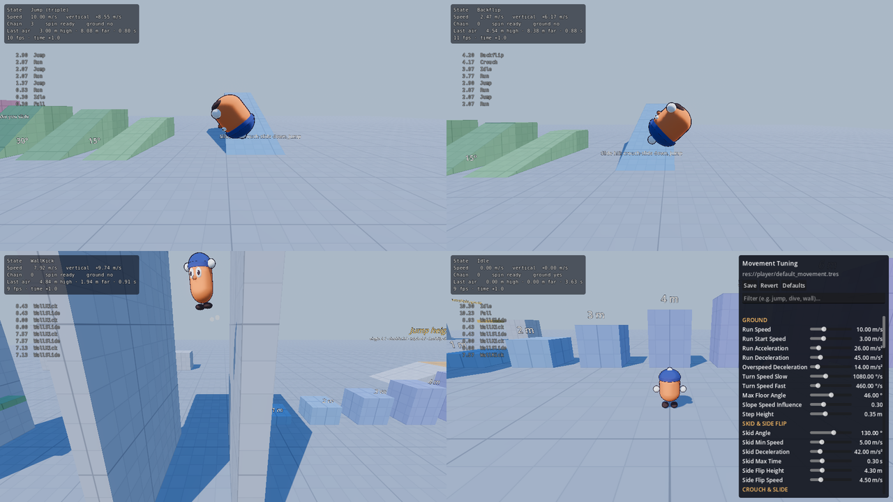

# Ultrajump

A base for a 3D platformer with a deep, expressive, momentum-driven moveset in
the spirit of Super Mario 64 — rebuilt on a modern engine without the old
constraints. It includes a character controller, a procedurally animated
placeholder character, a platforming camera, and a **movement gym**: a test
level with debug tools for tuning how everything feels.

Built with **Godot 4.7** (4.7.2 stable), GDScript, Jolt physics.



## Getting started

1. Install [Godot 4.7](https://godotengine.org/download) (the standard build; no .NET needed).
2. Open the project (`project.godot`) and press **F5** to play.
3. Press **F1** in game to show or hide the controls and move list.

## Controls

| Action | Keyboard & mouse | Gamepad |
| --- | --- | --- |
| Move | WASD | Left stick |
| Camera | Mouse, arrow keys | Right stick |
| Jump | Space | A |
| Crouch / ground pound | Shift, C | LT, RT, B |
| Dive | E, left click | X |
| Spin | Q, right click | Y, RB |
| Walk (slow) | Ctrl | (tilt the stick less) |
| Recenter camera | Tab, middle click | LB |
| Respawn | R | Back |
| Free / capture the mouse | Esc / click | Start |

All bindings live in *Project Settings → Input Map*.

## Moveset

| Move | How |
| --- | --- |
| Run | Speed builds along your facing direction. Turns are tight when slow and wide when fast. |
| Skid & **side flip** | Reverse the stick at speed to skid; jump during the skid to side flip. |
| **Single / double / triple jump** | Jump again right as you land. The third jump needs running speed. Hold jump longer to jump higher. |
| **Backflip** | Crouch while standing, then jump. |
| Crouch slide & **long jump** | Crouch while running to slide (slopes speed you up), then jump. Keep crouch held when you land to chain another. |
| **Dive** & **rollout** | Dive in the air (or while running), land in a belly slide, jump to roll out, dive again. Diving head-first into a wall bonks you. |
| **Ground pound** | Crouch in the air. Jump the moment you land for the **ground pound jump**, or dive during it to cancel into a dive. |
| **Wall slide & wall kick** | Jump into a wall to cling and slide; jump to kick off. Kick back and forth between two walls to climb. |
| **Ledge grab** | Jump at a ledge to hang. Push toward it to climb, jump to hop up, pull away or crouch to drop. Barely missed ledges are mantled automatically. |
| **Air spin** | Spin in the air for a little lift and extra control, once per jump. |
| Steep slopes | Slopes steeper than 46° make you slide; jump to hop off. |
| Also | Coyote time, jump buffering, stair stepping, moving platforms, variable jump height. |

## The movement gym

The default scene is a grey-box test level with a 1 m grid (bold every 5 m) on
every surface, so heights and distances can be read at a glance. Press
**1–8** to teleport between its stations:

1. **Spawn**
2. **Jump heights** — pillars from 1 m to 7 m.
3. **Long jump runway** — gaps of 6, 8, 10 and 12 m.
4. **Wall kicks** — a 16 m shaft, and a wall with small ledges.
5. **Slopes & stairs** — 15°, 30°, 45° and 55° ramps, two flights of stairs, a slide hill.
6. **Ledges** — 2.4 m (mantle), 3.2 m and 4.0 m (grab).
7. **Moving platforms** — a shuttle, an elevator and a spinner.
8. **Tower course** — a spiral climb to a flag.

## Tuning the feel

Every number behind the movement lives in one resource,
`player/default_movement.tres` (script: `player/movement_settings.gd`). Jump
strengths are written as the height they reach, in meters, rather than as raw
velocities, so they stay meaningful when you change gravity.

In game:

| Key | Tool |
| --- | --- |
| **F2** | **Tuning panel**: a slider for every setting, grouped by move, applied instantly. **Save** writes the values back to the `.tres` (when running from the editor). **Revert** reloads the saved values, **Defaults** restores the script defaults. |
| **F3** | Slow motion: cycles 1×, 0.5×, 0.25×, 0.1×. |
| **F4** | Trajectory trail: your recent path, colored by move. |
| **F5** | Hide or show the readout (state, speed, jump chain and the height, distance and airtime of your last jump). |

You can also select the Player in the editor and edit its `settings` in the
inspector; each value has a tooltip.

## Project layout

```
main/                 Entry scene: level + player + camera + HUD, respawn and stations
player/
  player.gd           CharacterBody3D: input buffering and the physics helpers states share
  player_input.gd     Per-tick input snapshot (camera-relative; can be scripted)
  movement_settings.gd, default_movement.tres
  states/             One node per state, run by state_machine.gd
    ground_state.gd, air_state.gd   Shared ground / airborne behavior
  model/              Procedural character: look and animation
  effects/            Particles and synthesized sound effects
camera/               Third-person platforming camera
levels/
  movement_gym.tscn   The test level
  props/              Block (box / ramp / cylinder), MovingPlatform, grid shader
ui/                   Debug HUD and tuning panel
debug/                Trajectory trail
tests/                Headless movement tests
tools/                Script that generated the movement gym
```

### Engine setup

- **Jolt** physics, stepped at **120 Hz** with **physics interpolation** on,
  so movement is responsive and smooth at any frame rate. The camera follows
  the interpolated transform every rendered frame.
- **Forward+** renderer, 4× MSAA. The character's collider is a cylinder
  (flat feet: stable on ledge edges, predictable on steps).
- Physics layers: 1 = World (everything the player and camera collide with),
  2 = Player.

### How the character is put together

- **`Player`** holds what every state shares: the input snapshot and press
  buffers (coyote time, jump buffering), and helpers such as `run_move()`,
  `air_move()`, `apply_gravity()`, `find_ledge()` and stair stepping.
- **States** (`player/states/`) are small nodes under `Player/StateMachine`,
  one per move. Each implements `enter()`, `physics_update()` and `exit()`, and
  hands over with `transition_to(&"StateName", {message})`. Most build on
  `GroundState` or `AirState`; an air state mostly sets a few flags (gravity
  scale, air control, what it can cancel into) in `enter()`.
- **Visuals, sound and particles only listen** to the player's signals
  (`jumped`, `landed`, `state_changed`, …) and never affect movement. Replace
  `player/model` with an imported, animated character without touching
  gameplay code.
- **`PlayerInput`** is the only place that reads devices. Set
  `player.input.scripted = true` to drive the character from code: the tests
  do this, and it works the same way for replays, cutscenes or AI.

### Adding a move

1. Add a setting group for it in `movement_settings.gd`.
2. Create `player/states/my_move.gd` extending `AirState` (or `GroundState` /
   `PlayerState`), and add a node with that script under
   `Player/StateMachine` in `player/player.tscn`.
3. Trigger it from an existing state with `transition_to(&"MyMove")`.
4. Give it a pose in `player_model.gd` (`_animate`) and optionally a sound in
   `player_audio.gd`.
5. Add a test in `tests/movement_tests.gd`.

## Tests

The headless suite drives the player with scripted input through every move
and checks the results (apex heights against the settings, long jump
distance, wall-kick climbing, ledge climbs, stairs, slopes and more):

```sh
godot --headless --fixed-fps 120 -s res://tests/movement_tests.gd
```

The exit code is the number of failed checks. Expected values are read from
the settings, so the tests keep passing while you tune.

## Rebuilding the gym

`levels/movement_gym.tscn` was generated by `tools/build_movement_gym.gd`.
Edit the scene directly: blocks are `Block` nodes whose shape, size and color
update live in the editor. Re-running the script **overwrites** the scene:

```sh
godot --headless -s res://tools/build_movement_gym.gd
```

## Ideas for what's next

- Replace the placeholder model and synthesized sounds with real assets.
- More moves: swimming, poles and ropes, cap-throw-style tools, rolling.
- Collectibles, goals and hazards to turn the gym into real levels.
- Tune the numbers with the F2 panel until it feels right.
